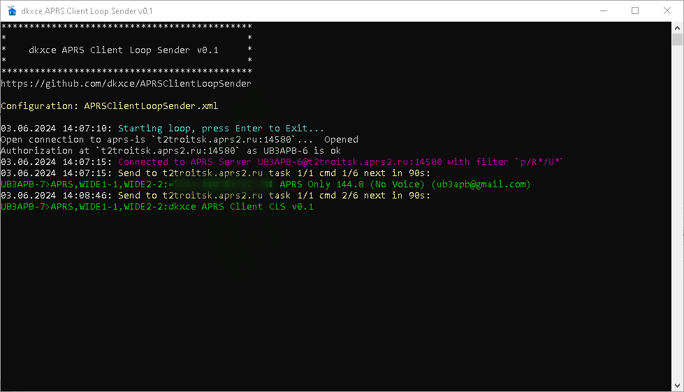
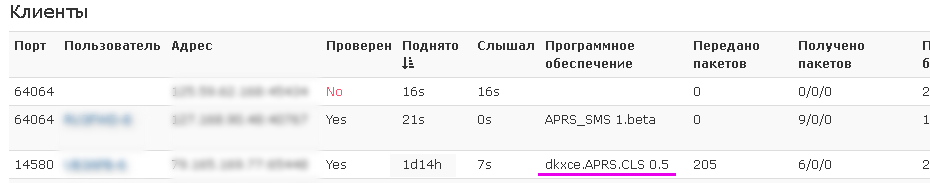

# APRSClientLoopSender (dkxce.APRS.CLS)

Simple Beacon APRS Sender. Looped send any APRS data to any APRS-IS servers.     

Features:   
- Allow Multiple APRS-IS Servers <servers!>
- Allow Multiple APRS Messages per Task<task[]!>
- Allow Multiple Tasks <tasks!>
- Allow Follow Track(s) <tracks!>
- Task Sheduler
- Config via XML
- Console mode
- Run as Service
- Log File (per Day)
- Save Track Follow Information on restart (file: APRSClientLoopSender.trk)

```
<?xml version="1.0" encoding="utf-8"?>
<XMLConfig>
  <servers>
    <server on="false" priority="9999" sever="localhost" port="14580" user="UNKNOWN" pass="-1" filter="p/R/U" ping="APRS,TCPIP*:&gt;online" readIncomingPackets="false" />
  </servers>
  <tasks>
    <task on="false" id="0" fromTime="00:00:00" tillTime="23:59:59" fromDate="2024-06-05" tillDate="2034-06-05" intervalSeconds="90">
		SFROM&gt;STO,WIDE1-1,WIDE2-2:Simple Text
		SFROM&gt;STO,WIDE1-1,WIDE2-2:&gt;Simple Status
		SFROM&gt;STO,WIDE1-1,WIDE2-2::TOALL    :Message. Hello All (I'm a teapot)
	</task>
  </tasks>
  <tracks>
    <track on="false" id="0" loopNext="-1" nextDelay="4000" speedDeviation="2" fromTime="00:00:00" tillTime="23:59:59" fromDate="2024-06-05" tillDate="2034-06-05" file="" />
  </tracks>
</XMLConfig>
```

       
       